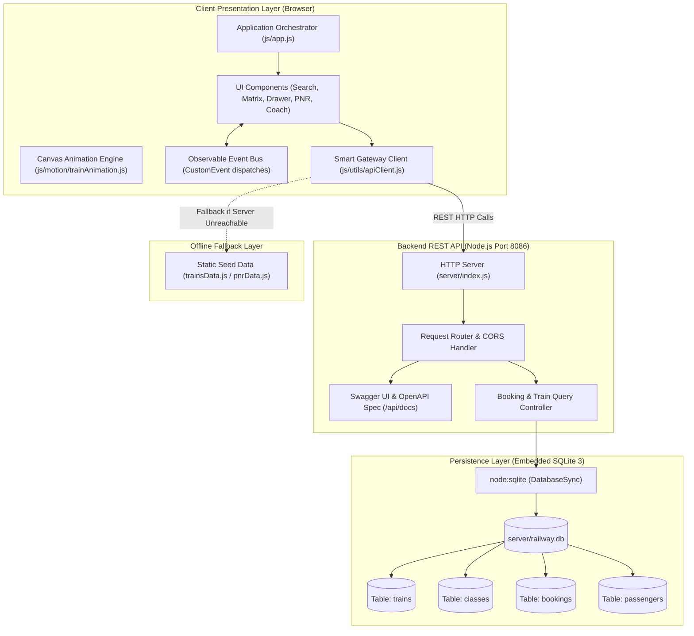
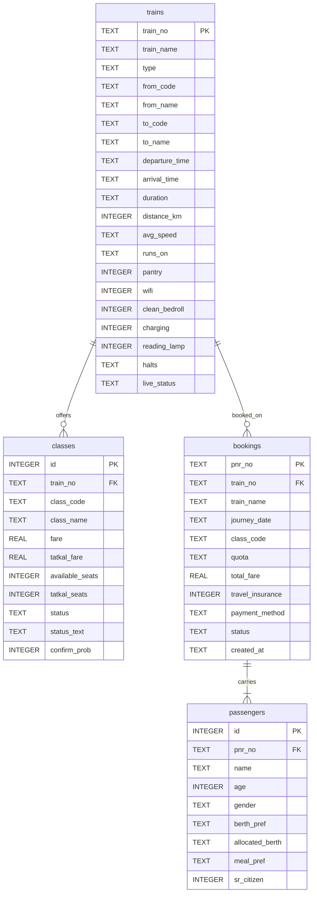

# 🚆 IRCTC Redesign Prototype: Full-Stack Railway Reservation System

[](https://nodejs.org/)
[-003B57?logo=sqlite&logoColor=white)](https://nodejs.org/api/sqlite.html)
[](#5-technology-stack)
[](LICENSE)

An independent full-stack railway reservation prototype inspired by the Indian Railways (IRCTC) booking experience. Built as a portfolio project to demonstrate clean web architecture, native Node.js REST APIs, relational SQLite persistence, and interactive user interface design using seeded mock data.

> ⚠️ **Disclaimer:** This is an independent educational and portfolio project. It is **not affiliated with, endorsed by, or connected to** the Indian Railway Catering and Tourism Corporation (IRCTC), the Centre for Railway Information Systems (CRIS), or the Ministry of Railways. All train numbers, schedules, fares, PNR records, and passenger details are simulated demo data. It does not connect to real railway reservation mainframes or process real financial payments.

---

## ⚡ Quick Evaluation & Live Demo

| Question | Evaluation Details |
| :--- | :--- |
| **What is this?** | An independent full-stack railway reservation prototype inspired by the Indian Railways (IRCTC) booking workflow. |
| **What does it demonstrate?** | Clean modular vanilla web architecture, a native Node.js REST API with zero external dependencies, transactional SQLite persistence, and accessible UI design. |
| **Can I see it live?** | **[Launch Live Web Demo](https://shubhamuttekar.github.io/irctc-nextgen-platform/)**<br>**[Explore Interactive API Docs](https://shubhamuttekar.github.io/irctc-nextgen-platform/api-docs.html)** (hosted on GitHub Pages). |
| **Quick Run (3 steps)** | `git clone https://github.com/Shubhamuttekar/irctc-nextgen-platform.git`<br>`cd irctc-nextgen-platform`<br>`node server/index.js` (Open `http://localhost:8086`) |

---

## 📑 Table of Contents
1. [Project Overview](#1-project-overview)
2. [Problem and Product Concept](#2-problem-and-product-concept)
3. [Key Features](#3-key-features)
4. [Demo & Interface Walkthrough](#4-demo--interface-walkthrough)
5. [Technology Stack](#5-technology-stack)
6. [System Architecture](#6-system-architecture)
7. [Booking Flow](#7-booking-flow)
8. [Database Schema](#8-database-schema)
9. [API Structure](#9-api-structure)
10. [Testing](#10-testing)
11. [Engineering Decisions and Tradeoffs](#11-engineering-decisions-and-tradeoffs)
12. [Project Scope and Limitations](#12-project-scope-and-limitations)
13. [Local Setup](#13-local-setup)
14. [Future Improvements](#14-future-improvements)

---

## 1. Project Overview

The **IRCTC Redesign Prototype** explores how modern web development patterns can streamline high-density public utility workflows. 

The application implements a complete reservation lifecycle: searching for trains between station codes, inspecting multi-class seat counts, visualizing coach berth layouts, creating transactional bookings with 10-digit PNR generation, and querying simulated booking and charting statuses.

The system is self-contained:
* **Backend:** Built using Node.js standard libraries (`node:http`) and Node v22's native SQLite module (`node:sqlite`). It requires **zero external NPM packages**.
* **Frontend:** Modular vanilla ES6 JavaScript with native DOM templates, custom event orchestration, and an HTML5 Canvas train animation.
* **Resilience:** An offline-first Smart Gateway client (`apiClient.js`) that automatically falls back to local structured data if the backend is unreachable.

### Clean Repository Layout

```text
irctc-nextgen-platform/
├── assets/                 # Vector SVGs, icons, and official insignia assets
├── css/                    # Modular stylesheets (main, components, animations)
├── docs/                   # OpenAPI specification & design exploration artifacts
│   ├── openapi.json        # Exported OpenAPI 3.0 specification
│   └── design-exploration/ # Iterative design sketches, audits, and research
├── js/                     # Client application (ES modules, components, utilities)
├── server/                 # REST API, SQLite database & test suite
├── index.html              # Main single-page application entry point
├── api-docs.html           # Interactive API Explorer & Swagger documentation
├── README.md               # Technical documentation and case study
└── LICENSE                 # MIT License
```

---

## 2. Problem and Product Concept

High-volume reservation websites often suffer from user experience challenges:
* **Information Fragmentation:** Passengers must frequently click back and forth between different train classes to compare availability and pricing.
* **Seating Ambiguity:** Passengers rarely have an intuitive visual understanding of where their allocated berth is located inside the coach.
* **Network Vulnerability:** Mobile users on unstable networks encounter abrupt page failures during connectivity drops.

### Concept Solutions in this Prototype:
* **Unified Availability Matrix:** Displays seat counts and fares across all available classes (1A, 2A, 3A, CC, EC, SL) simultaneously on each train card.
* **Interactive Coach Visualizer:** Renders realistic 2D coach berth configurations (Chair Car, Sleeper, 3-Tier AC, 2-Tier AC) with clear labels for Lower, Middle, Upper, Side Lower, Side Upper, and Window seats.
* **Graceful Degradation:** The client abstracts network requests through a smart gateway that falls back to structured immutable data if API calls fail, preserving interface usability.

---

## 3. Key Features

* **Smart Train Search:** Search by station name or station code (e.g., `NDLS` - New Delhi, `BSB` - Varanasi, `CSMT` - Mumbai CSMT, `HWH` - Howrah).
* **Unified Class & Quota Filtering:** Filter by General (GN), Tatkal (TQ), and Premium Tatkal (PT) quotas.
* **Heuristic Confirmation Estimation:** Displays estimated confirmation probabilities calculated from historical class demand heuristics (not a machine learning model).
* **Interactive Coach & Berth Visualizer:** Clickable coach layouts showing physical seat positions, emergency windows, and accessibility indicators.
* **3-Step Reservation Drawer:** Progressive form collecting passenger details, meal preferences, travel insurance opt-ins, and simulated payment selection.
* **Simulated Digital E-Ticket:** Generates printable ticket views with breakdown calculations (Base fare + GST + Superfast charge) and client-side vector QR codes.
* **PNR Status Enquiry:** Look up booking records, allocated coach/berth details, and charting status indicators (*CHART PREPARED* vs *CHART NOT PREPARED*).
* **Tatkal Countdown Timers:** Countdown clocks based on configured AC and Non-AC Tatkal opening times (10:00 AM for AC, 11:00 AM for Non-AC).
* **Accessibility-Focused Controls:** High Contrast toggle and 3-tier font size scaling (`A-` / `A` / `A+`).
* **Multilingual Localization:** Client-side dictionary translations across 5 languages: English, हिन्दी (Hindi), বাংলা (Bengali), தமிழ் (Tamil), and मराठी (Marathi).
* **Canvas Train Animation:** Procedural animation of the Vande Bharat 2.0 express built with HTML5 Canvas 2D and `requestAnimationFrame`.

---

## 4. Demo & Interface Walkthrough

```text
+-----------------------------------------------------------------------------------+
|  [Gov Strip] Government of India | Accessibility: [A- A A+] [Contrast] [Lang: EN] |
+-----------------------------------------------------------------------------------+
|  [Header] IRCTC Redesign Prototype (Independent Portfolio Project)               |
|  Capsule Menu: [ HOME | TRAINS v | PNR ENQUIRY | LIVE STATUS | TATKAL HUB ]      |
+-----------------------------------------------------------------------------------+
|  [Canvas Animation] Vande Bharat 2.0 Motion Graphic (Toggle: 130 km/h / 160 km/h) |
+-----------------------------------------------------------------------------------+
|  [Search Engine] From: [NDLS] <--> To: [BSB] | Date: [2026-09-30] | Quota: [GN]   |
+-----------------------------------------------------------------------------------+
|  [Train Card] 22436 - VANDE BHARAT EXPRESS (NDLS -> BSB | 06:00 -> 14:00 | 8h 00m) |
|  Matrix: [CC: AVAILABLE - 142 seats | ₹1,380] [EC: AVAILABLE - 28 seats | ₹2,450] |
|  Actions: [Book Now] [View Coach Layout]                                          |
+-----------------------------------------------------------------------------------+
|  [Booking Drawer] Step 1: Passengers -> Step 2: Review & Fare -> Step 3: E-Ticket |
+-----------------------------------------------------------------------------------+
```

### Representative Seeded Demo Records:
* **PNR `2847193852`**: Vande Bharat 2.0 (22436) — Status: **CONFIRMED (CNF)** | Coach C2 | Berths 42, 43, 44 | Chart: *CHART PREPARED*
* **PNR `6491028471`**: Howrah Rajdhani (12302) — Status: **RAC 01 / RAC 02** | Coach B4 | Berths 15, 16 | Chart: *CHART NOT PREPARED*
* **PNR `8371940285`**: Mumbai Tejas Rajdhani (12952) — Status: **WAITLIST (WL 02)** | Coach WL | Chart: *CHART NOT PREPARED*

---

## 5. Technology Stack

| Layer | Technology | Details & Implementation Notes |
| :--- | :--- | :--- |
| **Runtime** | **Node.js v22.23+** | Uses modern ECMAScript modules (`"type": "module"`). |
| **Backend Server** | **Native `node:http`** | Custom lightweight request router with CORS preflight and JSON body parsing. Zero external dependencies. |
| **Database** | **SQLite 3 (`node:sqlite`)** | Embedded SQL engine using Node v22's native `DatabaseSync` API. Single-file storage at `server/railway.db`. |
| **API Documentation** | **OpenAPI 3.0.3 / Swagger** | Complete OpenAPI specification (`server/openapi.js`) rendered via embedded Swagger UI at `/api/docs`. |
| **Frontend Framework** | **Vanilla JavaScript (ES6+)** | Web component architecture, template literals, and native DOM manipulation. No build or bundling tools required. |
| **Animation Engine** | **HTML5 Canvas 2D** | Procedural rendering using `window.requestAnimationFrame` with delta-time compensation. |
| **Styling** | **Modern CSS3** | Custom properties (CSS variables), CSS Grid, Flexbox, media queries, and high-contrast theme classes. |

---

## 6. System Architecture



---

## 7. Booking Flow

The booking lifecycle represents a multi-step transactional pipeline:

```text
[1. Search]
      │  User selects Origin (NDLS), Destination (BSB), Journey Date, and Quota (GN)
      ▼
[2. Availability Query]
      │  Client queries GET /api/trains/search -> Database returns matching trains and seat counts
      ▼
[3. Class Selection]
      │  User compares classes (e.g., CC vs EC) in Unified Availability Matrix
      ▼
[4. Passenger Entry]
      │  Drawer collects Name, Age, Gender, Berth Preference, and Senior Citizen status
      ▼
[5. Fare Computation]
      │  Server calculates: Total = (Base Fare * Passenger Count) + GST (5%) + Surcharges
      ▼
[6. Berth Allocation]
      │  Berth assigner allocates coach & berth; prioritizes Lower Berths for seniors (60+)
      ▼
[7. Atomic Transaction]
      │  BEGIN TRANSACTION
      │  -> Deducts seats: UPDATE classes SET available_seats = available_seats - ?
      │  -> Inserts booking record: INSERT INTO bookings ...
      │  -> Inserts passenger records: INSERT INTO passengers ...
      │  COMMIT (Rolls back if seats are insufficient)
      ▼
[8. PNR Generation & Confirmation]
      │  Generates a 10-digit numeric demo PNR (e.g., 4829104821)
      ▼
[9. E-Ticket Render]
         Client displays printable digital ticket with booking summary and scannable QR code
```

---

## 8. Database Schema

The database schema is defined in `server/db.js` and managed via SQLite 3:



---

## 9. API Structure

All API endpoints communicate using standard JSON payloads over HTTP:

| HTTP Method | Route | Description | Query / Request Body | Sample Response |
| :--- | :--- | :--- | :--- | :--- |
| `GET` | `/api/health` | System status & database diagnostics | None | `{ "status": "UP", "database": "sqlite-native-v22", "uptime": 45 }` |
| `GET` | `/api/trains/search` | Search trains between stations | `?from=NDLS&to=BSB&date=2026-09-30&quota=GN` | `[ { "train_no": "22436", "train_name": "Vande Bharat Express", "classes": [...] } ]` |
| `GET` | `/api/trains/:trainNo` | Detailed train schedule & halt stations | `trainNo` path parameter | `{ "train_no": "22436", "halts": [ {...} ] }` |
| `POST` | `/api/bookings` | Create ticket reservation | `{ "trainNo": "22436", "classCode": "CC", "journeyDate": "2026-09-30", "quota": "GN", "passengers": [...] }` | `{ "success": true, "pnr": "4829104821", "totalFare": 2898, "passengers": [...] }` |
| `GET` | `/api/pnr/:pnrNo` | Query booking & charting status | `pnrNo` path parameter | `{ "pnr_no": "2847193852", "status": "CONFIRMED", "chart_status": "CHART PREPARED" }` |
| `GET` | `/api/docs` | Interactive Swagger / OpenAPI playground | None | HTML documentation dashboard ([Live Online](https://shubhamuttekar.github.io/irctc-nextgen-platform/api-docs.html)) |

---

## 10. Testing

The repository includes an automated integration test suite in `server/test-api.js`.

### Running Tests Locally:
```bash
cd server
npm test
# Or: node test-api.js
```

### Test Coverage Breakdown (36 Automated Assertions):
* **Database & Health (4 tests):** Verifies SQLite connection, schema initialization, and pre-seeded record counts.
* **Search Engine (4 tests):** Verifies route matching (`NDLS` ➔ `BSB`), fare retrieval, and class availability reporting.
* **Train Timetable & Halts (4 tests):** Verifies train lookup (`12002` Bhopal Shatabdi), intermediate halts parsing, and 404 handling for invalid train numbers.
* **Transactional Reservation (6 tests):** Validates payload schema, computes GST and base fare, decrements seat counts, generates 10-digit numeric PNR, and assigns coach/berth numbers.
* **PNR Status Lookup (9 tests):** Verifies querying newly created bookings, retrieving pre-seeded confirmed (`2847193852`), RAC (`6491028471`), and waitlist records, and testing 404 behavior on non-existent PNRs.
* **Seat Inventory & Overbooking Protection (5 tests):** Verifies accurate seat inventory decrements, enforces 6-passenger booking limit rules, rejects overbooking requests exceeding capacity, and guarantees inventory remains untouched on failure.
* **Atomic Transaction Rollback (4 tests):** Proves atomic SQLite transaction rollback on mid-flight failure, verifying zero partial booking records, zero orphan passenger rows, and pristine seat counts.

---

## 11. Engineering Decisions and Tradeoffs

### 1. Why Native SQLite (`node:sqlite`) for a Self-Contained Prototype?
* **Zero Configuration Overhead:** Rather than requiring external database processes (PostgreSQL/MySQL), Docker containers, or environment connection strings, Node.js v22's native SQLite engine runs in-process.
* **Full Relational Modeling:** Supports foreign keys, parameterized queries, and ACID transaction semantics (`BEGIN TRANSACTION` ... `COMMIT`).
* **Evaluation Simplicity:** Anyone cloning the repository can run `node server/index.js` immediately without setting up external database servers.
* **Tradeoff:** SQLite writes are serialized (single-writer). For a distributed, multi-region production deployment with millions of concurrent writes, a distributed database like PostgreSQL or CockroachDB would be required. For a self-contained portfolio prototype, SQLite provides the optimal balance of relational integrity and zero-friction setup.

### 2. Why Vanilla ES6 Modules over Frameworks (React/Vue/Angular)?
* **Direct Platform Execution:** Avoids a framework runtime and build pipeline for this prototype. This keeps the project self-contained and demonstrates native browser APIs directly.
* **No Build Step Required:** Uses native browser ES module imports (`import { HeaderCapsule } from './components/headerCapsule.js'`), allowing code to be served directly without Babel or Webpack.
* **Demonstrates Core Web APIs:** Showcases native DOM manipulation, Custom Events, and Canvas 2D rendering without relying on framework abstractions.
* **Tradeoff:** State synchronization across distant components requires manual event orchestration rather than automatic reactive re-renders.

### 3. Why an Offline-First Smart Gateway?
* **Network Partition Tolerance:** In live demos or local testing without a running server, `apiClient.js` catches fetch errors and gracefully falls back to structured mock data.
* **Consistent User Experience:** Users exploring the prototype never encounter unhandled promise rejections or empty, broken layouts.

---

## 12. Project Scope and Limitations

To maintain clear and accurate engineering expectations, the following limitations are explicitly noted:

* **Seeded Demo Data:** All train schedules, fares, station halts, passenger names, and PNR numbers are simulated mock data.
* **No Real Banking or Payment Integration:** The payment selection step simulates gateway success; no actual financial transactions or payment processor APIs (Stripe, Razorpay) are invoked.
* **No Official Railway Mainframe Integration:** The system has no connection to the Centre for Railway Information Systems (CRIS) or official Passenger Name Record (PNR) databases.
* **Heuristic Probabilities:** Confirmation probabilities are estimated using rule-based heuristics (based on class demand and seat count ranges) rather than predictive machine learning models.
* **Single-Process Persistence:** The SQLite database is local to the server instance and does not handle multi-node replication.

---

## 13. Local Setup

### Prerequisites
* **Node.js**: Version `v22.0.0` or higher (required for native `node:sqlite` support).
* **Git**: For cloning the repository.

### Installation & Run Steps
1. **Clone the repository:**
   ```bash
   git clone https://github.com/Shubhamuttekar/irctc-nextgen-platform.git
   cd irctc-nextgen-platform
   ```

2. **Verify Node.js version:**
   ```bash
   node --version
   # Expected: v22.x.x or higher
   ```

3. **Start the backend server:**
   ```bash
   node server/index.js
   ```
   *(On Windows, you can also double-click `server/start.bat`)*.

4. **Access the application:**
   * **Web Interface:** Open `http://localhost:8086/` in any modern web browser.
   * **Interactive Swagger Documentation:** Open `http://localhost:8086/api/docs` or `http://localhost:8086/api-docs.html`.
   * **Health Telemetry Endpoint:** Open `http://localhost:8086/api/health`.

5. **Run automated tests:**
   ```bash
   cd server
   npm test
   # Or from root directory: node server/test-api.js
   ```

---

## 14. Future Improvements

If extended into a larger production-scale application, logical next steps would include:
* **Payment Sandbox Integration:** Connecting a payment gateway sandbox (e.g., Razorpay / Stripe test mode) with webhook verification.
* **Authentication & User Profiles:** Adding JWT or session-based authentication with bcrypt password hashing and saved passenger lists.
* **Database Scaling:** Migrating from SQLite to PostgreSQL with connection pooling (e.g., `pg-pool`) and database migrations.
* **Service Worker Caching:** Implementing a Progressive Web App (PWA) service worker to cache static assets for full offline page reloads.
* **WebSocket Updates:** Real-time seat count broadcasting using WebSockets (`ws`) during active booking sessions.

---

## 📄 License
This project is licensed under the MIT License - see the [LICENSE](LICENSE) file for details.
